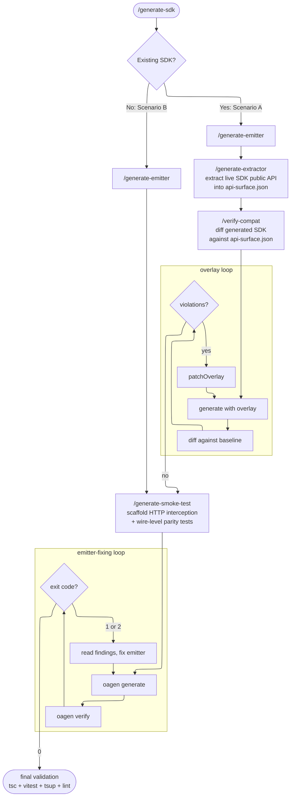

# /generate-sdk Workflow

```mermaid
---
config:
    layout: elk
---
flowchart TD
    start([/generate-sdk]) --> existingSDK{Existing SDK?}

    existingSDK -- "Yes: Scenario A" --> a_emitter["/generate-emitter"]
    existingSDK -- "No: Scenario B" --> b_emitter["/generate-emitter"]

    a_emitter --> a_extractor["/generate-extractor
    extract live SDK public API
    into api-surface.json"]

    a_extractor --> a_compat["/verify-compat
    diff generated SDK
    against api-surface.json"]

    a_compat --> overlay_gen

    subgraph overlay loop
        overlay_gen["generate with overlay"]
        overlay_gen --> overlay_diff["diff against baseline"]
        overlay_diff --> violations{violations?}
        violations -- yes --> patch["patchOverlay"]
        patch --> overlay_gen
    end

    violations -- no --> smoke["/generate-smoke-test
    scaffold HTTP interception
    + wire-level parity tests"]

    b_emitter --> smoke

    smoke --> loop_start

    subgraph emitter-fixing loop
        loop_start["oagen generate"]
        loop_start --> loop_verify["oagen verify"]
        loop_verify --> exitcode{exit code?}
        exitcode -- "1 or 2" --> fix["read findings, fix emitter"]
        fix --> loop_start
    end

    exitcode -- 0 --> final(["final validation
    tsc + vitest + tsup + lint"])
```
